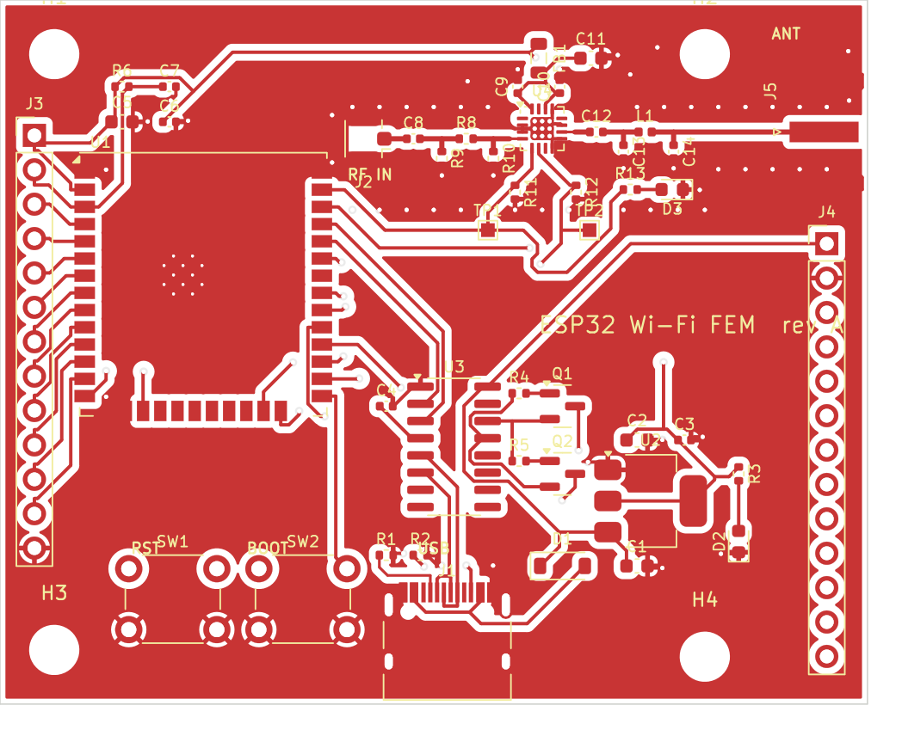

# ESP32 Wi-Fi FEM board, rev A. Описание конструкции

Плата повторяет идею ESP32-M1 Reach Out (Bison Science): между модулем ESP32 и антенной
стоит внешний ВЧ-фронтенд (усилитель мощности + малошумящий усилитель + переключатель
приём/передача), а сигнал «сейчас передача / сейчас приём» ESP32 выдаёт на два GPIO
штатной функцией антенного разнесения ESP-IDF. Отличия от оригинала:

| | Reach Out | Эта плата |
|---|---|---|
| ESP32 | голый чип + внешняя флеш | модуль ESP32-WROOM-32U (с U.FL) |
| Фронтенд | Qorvo QPF4219, 5 В, до 1 Вт | Skyworks RFX2401C, 3,3 В, до 100 мВт |
| Bluetooth-тракт | есть, отдельная антенна | нет |
| Переключатели | 2× RFSW8009 | нет, переключатель внутри RFX2401C |
| Аттенюатор | 18 дБ | площадки под пи-аттенюатор, по умолчанию 0 Ом |
| Плата | 4 слоя, 62×40 мм | 4 слоя, 64×52 мм |
| Исходники | только PDF | KiCad 7, генерируется скриптами |

Мощность выбрана под лимит 100 мВт ЭИИМ (Израиль, ЕС). Основной выигрыш по дальности
даёт LNA на приёме (около 12 дБ усиления, шум около 2,5 дБ против 6–8 дБ у ESP32) и
внешняя антенна с усилением.

## Блок-схема

```
USB-C ──D1──> +5V ──AMS1117──> +3V3 ──FB1──> +3V3_RF
  │                              │
  └──> CH340C ──UART/DTR/RTS──> ESP32-WROOM-32U
                                 │  U.FL
                                 │  (пигтейл U.FL–U.FL, 5–10 см)
                                 v
        J2 U.FL ──C8──[R8/R9/R10]──> RFX2401C ──C12──[L1/C13/C14]──> J5 SMA ──> антенна
                                       ^  ^
                        GPIO23 (TXEN) ─┘  └─ GPIO18 (RXEN)
```

## ВЧ-тракт

1. **J2, U.FL.** Вход с модуля. Модуль WROOM-32U отдаёт до +20 дБм на своём U.FL.
2. **C8, 100 пФ.** Разделительный конденсатор: вход TXRX у RFX2401C по постоянному току замкнут на землю.
3. **R8/R9/R10.** Площадки под пи-аттенюатор. Rev A: R8 = 0 Ом, R9/R10 не ставятся. Мощность
   ESP32 ограничивается прошивкой (по умолчанию +8 дБм), чтобы не перегрузить вход
   усилителя (P1dB входа около +5 дБм). Если нужно поднять мощность ESP32, ставится пад 3–6 дБ.
4. **U4, RFX2401C.** PA около 22 дБ усиления, +20 дБм на выходе для 802.15.4; для OFDM Wi-Fi
   держать +17…+19 дБм, дальше растёт EVM. LNA около 12 дБ. Встроенный фильтр гармоник.
   Логика: TXEN=1 передача, TXEN=0 и RXEN=1 приём, оба 0 микросхема выключена (тракт разомкнут!).
   R11/R12 100 кОм притягивают входы к земле, чтобы до инициализации прошивки усилитель спал.
5. **C12, L1, C13, C14.** Разделительный конденсатор и пи-фильтр 3 нГн / 1,2 пФ (значения как в
   открытом проекте AnyLeaf ELRS на той же микросхеме). Подавляет остатки гармоник.
6. **J5, SMA edge.** Антенный разъём. Для Wi-Fi антенн с AliExpress чаще нужен RP-SMA,
   посадочное место одинаковое, выбирайте разъём под свою антенну.

Все ВЧ-дорожки: микрополосок 0,38 мм на верхнем слое над сплошной землёй второго слоя
(стек JLC04161H-7628, 50 Ом). Вокруг дорожек забор из земляных переходных.

## Управление TXEN/RXEN

В прошивке (см. `firmware/components/fem_rfx2401`) вызывается `esp_wifi_set_ant_gpio()` с
GPIO23 как бит 0 и GPIO18 как бит 1, затем `esp_wifi_set_ant()` с кодом антенны 1 (0b01) для
передачи и 2 (0b10) для приёма. MAC ESP32 сам переключает ножки на каждом переходе
приём/передача, процессор не участвует. Ровно так сделано в Reach Out.

Проверка: на TP1 (TXEN) осциллографом видны импульсы при передаче, на TP2 (RXEN) высокий
уровень в паузах. Светодиод D3 мигает при передаче.

## Питание

USB-C 5 В через диод Шоттки D1 (защита от обратного тока при внешнем 5 В на J4.1),
AMS1117-3.3 на 1 А. Потребление: ESP32 до 500 мА в пиках, RFX2401C около 130 мА на передаче.
Питание усилителя через ферритовую бусину FB1 и 10 мкФ + 100 нФ + 10 пФ у выводов.

## USB-UART и автосброс

CH340C (кварц не нужен), DTR/RTS через два S8050 на EN и IO0, как в ESP32-DevKitC.
Кнопки RESET (EN) и BOOT (IO0). Прошивка через `idf.py flash` без нажатия кнопок.

## Что вынесено на разъёмы

J3 (левый): 3V3, EN, VP, VN, IO34, IO35, IO32, IO33, IO25, IO26, IO27, IO14, GND.
J4 (правый): 5V, GND, IO12, IO13, IO15, IO2, IO4, IO16, IO17, IO5, IO19, IO21, IO22.
GPIO18 и GPIO23 заняты управлением усилителем.

## Известные ограничения rev A и что проверить первым делом

- Распиновка RFX2401C сверена по открытому проекту AnyLeaf (AT2401C, pin-to-pin) и
  фрагментам даташита: 4 TXRX, 5 TXEN, 6 RXEN, 10 ANT, 14/16 VDD, 1/7/12/15 NC, остальные GND.
  Перед заказом откройте даташит RFX2401C и сверьте таблицу выводов ещё раз.
- Пигтейл U.FL–U.FL между модулем и J2 добавляет около 0,5 дБ потерь и требует аккуратности.
  В rev B логично перейти на ESP32-PICO-D4 с выводом LNA_IN прямо на плату.
- Значения пи-фильтра не измерялись на этой плате. Если есть анализатор спектра, проверьте
  вторую гармонику (4,9 ГГц) на максимальной мощности.
- Первая ревизия ВЧ-платы почти всегда требует правок. Заложите вторую.

## Итоговая разводка rev A

Плата разведена полностью, DRC без ошибок (остались только косметические предупреждения
шелкографии). Верхний слой и общий вид меди:



ВЧ-цепь идёт вдоль верхнего края отдельным микрополоском над сплошной землёй, вокруг забор
земляных переходных. Остальные цепи разведены автотрассировщиком freerouting, ВЧ и CC1
разведены вручную. Производственные файлы (Gerber, сверловка, BOM, CPL) лежат в
`hardware/kicad/build/fab/`, архив для загрузки на JLCPCB — `esp32_fem_gerbers.zip`.
